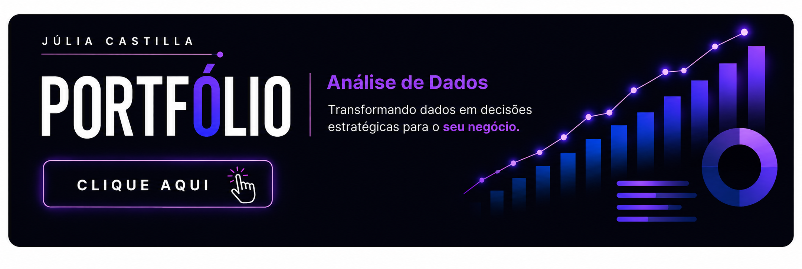

## Olá

## Sobre mim

**Analista de Dados em formação pela EBAC**, graduada em **Marketing Digital pela Universidade Estácio de Sá**, com trajetória profissional orientada pela **análise de métricas, indicadores e performance**.

Atualmente, desenvolvo projetos em **Análise de Dados**, utilizando **SQL, Python, Power BI, Google BigQuery e pandas** em processos de **exploração, tratamento e validação de dados**, análise de grandes volumes de dados, construção de dashboards e desenvolvimento de análises voltadas a **problemas de negócio**.

Minha experiência anterior em **Marketing Digital** complementa meu perfil analítico com **visão de negócio** e experiência em análise de **KPIs, performance, comportamento e identificação de oportunidades**.

Busco atuar como **Analista de Dados**, transformando dados em **análises e recomendações que apoiem a tomada de decisão**.

## Tecnologias e Ferramentas

**Análise e Programação:** Python • SQL • pandas • NumPy  
**Business Intelligence:** Power BI • DAX • Power Query • Looker Studio  
**Bancos de Dados:** Google BigQuery • MySQL  
**Análise e Visualização:** EDA • Estatística Descritiva • Matplotlib • Seaborn • Plotly • Dash  
**Machine Learning:** Regressão Logística • Random Forest  
**Dados e Produtividade:** Excel • Google Sheets  
**Desenvolvimento:** Git • GitHub • Linux • Jupyter Notebook • Visual Studio Code

## Meu Portfólio

Projetos de **Análise de Dados** desenvolvidos em diferentes contextos de negócio, envolvendo **exploração, tratamento e validação de dados, SQL, programação, Business Intelligence, Machine Learning e visualização**, com foco na transformação de dados em **análises que apoiem a tomada de decisão**.

 

 

## Contatos

  

  

